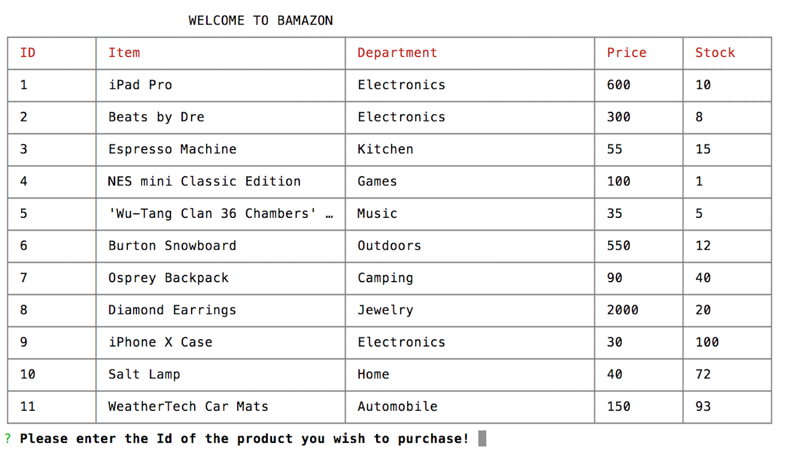
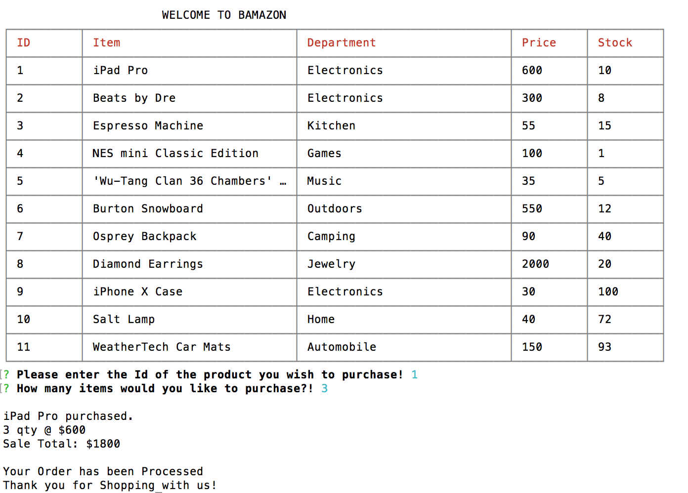
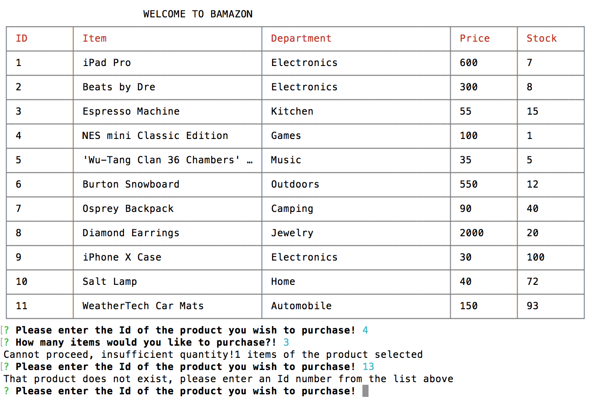

Bamazon is a storefront application built with MYSQL, Javascript and Node.js.

Summary
In the customer portal you can view products, prices, the department and quantity available. Choose the item you want and purchase. If there is not sufficient inventory for the quantity requested you will get notice of the lack of availability. The app will then notify that it's unable to fulfill the request and the purchase will not go through. 

Display listing available products, department, price and quantity.

Quantity total price and order processed.

Response for insufficient quanity request or for an ID that does not exist.

